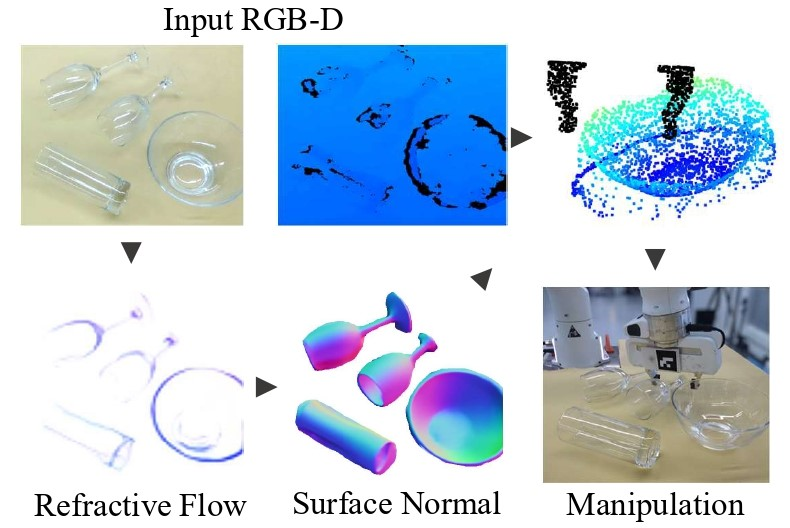
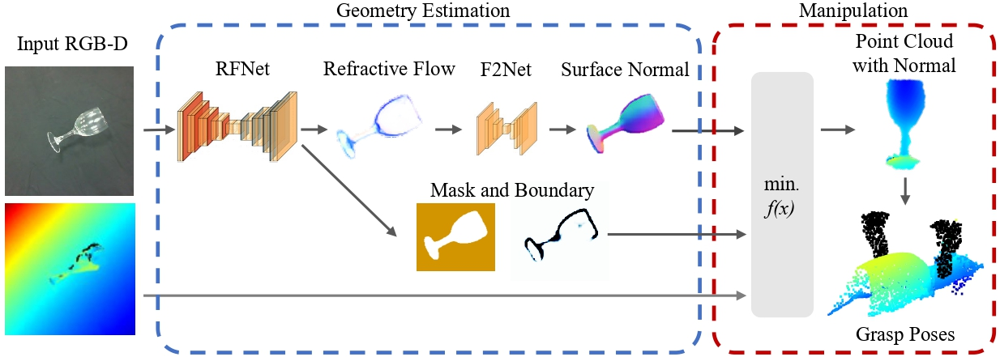

# RFTrans: Leveraging Refractive Flow of Transparent Objects for Surface Normal Estimation and Manipulation

[[Paper]](https://arxiv.org/abs/todo) [[Project Page]](https://sites.google.com/view/rftrans) 
[[Code (Data Generation)]](https://github.com/LJY-XCX/Unity-RefractiveFlowRender) 



We present RFTrans, an RGB-D-based method for surface normal estimation and manipulation 
of transparent objects. By leveraging refractive flow as an intermediate representation, 
RFTrans circumvents the drawbacks of directly predicting the geometry (e.g. surface normal) 
from RGB images and helps bridge the sim-to-real gap.

## Approach



## Quick Start

### Setup

1. Clone this repository
```bash
git clone git@github.com:LJY-XCX/RFTrans.git
```

2. Download our synthetic dataset from https://huggingface.co/datasets/robotflow/rftrans

3. Install dependencies
```bash
pip install -r requirements.txt
```

### Training Process

#### RFNet Training

```bash
cd pytorch_networks/refractive_flow
python train.py -c ./config/config.yaml
```

#### F2Net Training

```bash
cd pytorch_networks/flow2normal
python train.py -c ./config/config.yaml
```

#### End-to-End Training

```bash
cd pytorch_networks/rgb2normal
python train.py -c ./config/config.yaml
```

If you want to evaluate the model and generate results, please run
```bash
python eval.py -c ./config/config.yaml
```

